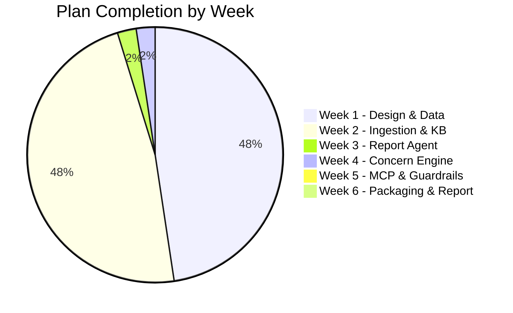

# Project Status Audit

Audit of repository state against [AI_Project_Intelligence_Agent_Plan.md](file:///c:/Users/nullptr____/Desktop/VSF_AI-Intelligent-Agent-For-PM/AI_Project_Intelligence_Agent_Plan.md).

---

<!-- ## Overall Progress

--- -->

## Week 1 — Design & Data Prep

| #   | Task                                                                  | Status     | Evidence                                                                                                                                                                                   |
| --- | --------------------------------------------------------------------- | ---------- | ------------------------------------------------------------------------------------------------------------------------------------------------------------------------------------------ |
| 1.1 | **SQLite schema** (entities, snapshots, backlinks, sync_log)          | ✅ Done    | [init_db.py](file:///c:/Users/nullptr____/Desktop/VSF_AI-Intelligent-Agent-For-PM/src/storage/init_db.py) — All 4 tables + `audit_log` + indexes                                           |
| 1.1 | **ChromaDB schema** (3 collections)                                   | ✅ Done    | [chroma_store.py](file:///c:/Users/nullptr____/Desktop/VSF_AI-Intelligent-Agent-For-PM/src/storage/chroma_store.py) — `confluence_chunks`, `meeting_chunks`, `jira_descriptions`           |
| 1.2 | **Jira synthetic data** (ground truth)                                | ✅ Done    | [jira_synthetic_AIP.json](file:///c:/Users/nullptr____/Desktop/VSF_AI-Intelligent-Agent-For-PM/data/jira/jira_synthetic_AIP.json) — 1000 issues, 8+ anomalies with `_ground_truth`         |
| 1.2 | **Confluence synthetic data** (JSON + metadata)                       | ✅ Done    | [confluence_synthetic.json](file:///c:/Users/nullptr____/Desktop/VSF_AI-Intelligent-Agent-For-PM/data/confluence/confluence_synthetic.json) — 217 pages, linked Jira epics/issues          |
| 1.2 | **Meeting Notes**                                                     | ✅ Done    | [meeting_notes.json](file:///c:/Users/nullptr____/Desktop/VSF_AI-Intelligent-Agent-For-PM/data/meeting_notes/meeting_notes.json) — 5 meetings with action items + ground truth             |
| 1.2 | **Inject 4 anomaly types** (Stalled, Deadline, Blocker, Cross-source) | ✅ Done    | AIP-30 (conflict), AIP-37 (stalled), AIP-53 (deadline), AIP-67 (blocker)                                                                                                                   |
| 1.3 | **Python repo structure** (src/, data/, tests/, config/)              | ✅ Done    | Proper layout with `pyproject.toml`                                                                                                                                                        |
| 1.3 | **Linter config** (flake8 + black)                                    | ✅ Done    | `.flake8` created and `[tool.black]` added to `pyproject.toml`                                                                                                                             |
| 1.3 | **config.py with thresholds**                                         | ✅ Done    | [config.py](file:///c:/Users/nullptr____/Desktop/VSF_AI-Intelligent-Agent-For-PM/config.py) — `STALLED_DAYS`, `DEADLINE_RISK_DAYS`, `BLOCKER_OPEN_DAYS`, `CONFLICT_WINDOW_H`, chunk params |
| 1.3 | **Basic unit test** (CI green)                                        | ✅ Done    | 7 test files exist, though `test_agent.py` references nonexistent `Agent` class                                                                                                            |

---

## Week 2 — Ingestion Pipeline & Knowledge Base

| #   | Task                                         | Status     | Evidence                                                                                                                                                                                                                                                                                |
| --- | -------------------------------------------- | ---------- | --------------------------------------------------------------------------------------------------------------------------------------------------------------------------------------------------------------------------------------------------------------------------------------- |
| 2.1 | **Jira connector** (normalized_doc)          | ✅ Done    | [jira_connector.py](file:///c:/Users/nullptr____/Desktop/VSF_AI-Intelligent-Agent-For-PM/src/ingestion/jira_connector.py) — Loads JSON, normalizes, extracts ADF text (87 lines)                                                                                                        |
| 2.1 | **Confluence connector**                     | ✅ Done    | [confluence_connector.py](file:///c:/Users/nullptr____/Desktop/VSF_AI-Intelligent-Agent-For-PM/src/ingestion/confluence_connector.py) — Reads folder of JSON files, validates, normalizes (168 lines)                                                                                   |
| 2.1 | **Meeting Notes connector**                  | ✅ Done    | [meeting_notes_connector.py](file:///c:/Users/nullptr____/Desktop/VSF_AI-Intelligent-Agent-For-PM/src/ingestion/meeting_notes_connector.py) — Handles both JSON collection + plain text, extracts issue keys (344 lines)                                                                |
| 2.2 | **Route 1 → ChromaDB** (chunking)            | ✅ Done    | [chroma_store.py](file:///c:/Users/nullptr____/Desktop/VSF_AI-Intelligent-Agent-For-PM/src/storage/chroma_store.py) — `add_confluence_chunks()` uses `MarkdownHeaderTextSplitter`, `add_meeting_chunks()` uses `RecursiveCharacterTextSplitter`, `add_jira_description()` upserts whole |
| 2.2 | **Route 2 → SQLite** (entity upsert)         | ✅ Done    | [sqlite_store.py](file:///c:/Users/nullptr____/Desktop/VSF_AI-Intelligent-Agent-For-PM/src/storage/sqlite_store.py) — `upsert_entity()`, `bulk_upsert()`, `save_snapshot()`, `update_sync_log()`                                                                                        |
| 2.2 | **Entity extraction** (regex + rules)        | ✅ Done    | `EntityExtractor` class orchestrates extraction of entities and backlinks from all 3 sources                                                                                                                                                            |
| 2.3 | **Day-over-day diff**                        | ✅ Done    | [sqlite_store.py:L134-154](file:///c:/Users/nullptr____/Desktop/VSF_AI-Intelligent-Agent-For-PM/src/storage/sqlite_store.py#L134-L154) — `get_daily_diff()` with SQL join                                                                                                               |
| —   | **Ingestion orchestrator** (run_pipeline.py) | ✅ Done    | `run_pipeline.py` implements the CLI to wire Connectors, `EntityExtractor`, and Stores. Includes integration tests in `test_run_pipeline.py`.                                                                                                                                                     |

---

## Week 3 — Report Agent (OpenAI SDK + ReAct Loop)

| #   | Task                                                              | Status     | Evidence                                                                                                                                                                                                 |
| --- | ----------------------------------------------------------------- | ---------- | -------------------------------------------------------------------------------------------------------------------------------------------------------------------------------------------------------- |
| 3.1 | **Tool definitions** (query_chroma, query_sqlite, get_daily_diff) | ✅ Done    | [tools/registry.py](file:///c:/Users/nullptr____/Desktop/VSF_AI-Intelligent-Agent-For-PM/src/tools/registry.py) — 3 OpenAI function-calling schemas + `dispatch_tool()` router wired to ChromaStore & SQLiteStore |
| 3.2 | **ReAct loop** (~50 lines, OpenAI SDK)                            | ✅ Done    | [agents/report_agent.py](file:///c:/Users/nullptr____/Desktop/VSF_AI-Intelligent-Agent-For-PM/src/agents/report_agent.py) — `run_report_agent()` pure OpenAI SDK loop, max 5 iterations, tool dispatch |
| 3.3 | **Citation enforcement** (system prompt)                          | ✅ Done    | `SYSTEM_PROMPT` in [agents/report_agent.py](file:///c:/Users/nullptr____/Desktop/VSF_AI-Intelligent-Agent-For-PM/src/agents/report_agent.py) — every claim must cite `[source_id]`, unsourced claims FORBIDDEN |
| —   | **report_agent.py**                                               | ✅ Done    | [src/agents/report_agent.py](file:///c:/Users/nullptr____/Desktop/VSF_AI-Intelligent-Agent-For-PM/src/agents/report_agent.py) — `ReportAgent` class + CLI entry-point, 20/20 tests passing               |

---

## Week 4 — Concern Engine (Rule-based + LLM)

| #   | Task                                                 | Status         | Evidence                                                                                                         |
| --- | ---------------------------------------------------- | -------------- | ---------------------------------------------------------------------------------------------------------------- |
| 4.1 | **Config thresholds**                                | ✅ Done        | [config.py](file:///c:/Users/nullptr____/Desktop/VSF_AI-Intelligent-Agent_For-PM/config.py) has all 4 thresholds |
| 4.2 | **Rule 1: Stalled task** (SQL)                       | ❌ Not started | No SQL query implementation                                                                                      |
| 4.2 | **Rule 2: Deadline risk** (SQL)                      | ❌ Not started | No SQL query implementation                                                                                      |
| 4.2 | **Rule 3: Unresolved blocker** (SQL)                 | ❌ Not started | No SQL query implementation                                                                                      |
| 4.3 | **Cross-source conflict** (Rule filter → LLM verify) | ❌ Not started | No implementation                                                                                                |
| 4.4 | **Severity scoring**                                 | ❌ Not started | No `score_severity()` function                                                                                   |
| —   | **concern_engine.py**                                | ❌ Not started | File does not exist. `main.py` imports `agents.concern_engine.ConcernEngine` which doesn't exist                 |

---

## Week 5 — MCP Server & Guardrails

| #   | Task                                   | Status         | Evidence                                                                                                                                                                |
| --- | -------------------------------------- | -------------- | ----------------------------------------------------------------------------------------------------------------------------------------------------------------------- |
| 5.1 | **MCP Server** (FastAPI + 3 endpoints) | ❌ Not started | No `mcp/` directory. `main.py` imports `mcp.server.MCPServer` which doesn't exist                                                                                       |
| 5.2 | **Input guardrail** (sanitize_input)   | ❌ Not started | No `guardrail/` directory. `main.py` imports `guardrail.sanitizer.Sanitizer` which doesn't exist                                                                        |
| 5.2 | **Output guardrail** (sanitize_output) | ❌ Not started | Same                                                                                                                                                                    |
| 5.2 | **Audit log** (SQLite)                 | ⚠️ Partial     | `audit_log` table exists in [init_db.py](file:///c:/Users/nullptr____/Desktop/VSF_AI-Intelligent-Agent-For-PM/src/storage/init_db.py#L62-L69), but no code writes to it |
| 5.3 | **End-to-end test** (curl commands)    | ❌ Not started | No API to test                                                                                                                                                          |

---

## Week 6 — Packaging & Report

| #   | Task                                   | Status         | Evidence                                            |
| --- | -------------------------------------- | -------------- | --------------------------------------------------- |
| 6.1 | **run_agent.sh** (one-command runner)  | ❌ Not started | File does not exist                                 |
| 6.2 | **V1**: e2e no crash                   | ❌ Not started | `main.py` would crash due to missing module imports |
| 6.2 | **V2**: report.md with 5+ citations    | ❌ Not started | No report agent                                     |
| 6.2 | **V3**: All 4 anomaly types detected   | ❌ Not started | No concern engine                                   |
| 6.2 | **V4**: Precision/Recall ≥ 80%         | ❌ Not started | No concern engine                                   |
| 6.2 | **V5**: Guardrail blocks 3+ injections | ❌ Not started | No guardrails                                       |
| 6.2 | **V6**: Live demo                      | ❌ Not started | —                                                   |
| 6.3 | **Tech Report**                        | ❌ Not started | —                                                   |

---

## File-Level Implementation Quality

### ✅ Production-Quality Files

| File                                                                                                                                        | Lines | Quality Notes                                                                   |
| ------------------------------------------------------------------------------------------------------------------------------------------- | ----- | ------------------------------------------------------------------------------- |
| [jira_connector.py](file:///c:/Users/nullptr____/Desktop/VSF_AI-Intelligent-Agent-For-PM/src/ingestion/jira_connector.py)                   | 87    | Clean, handles ADF text extraction, typed                                       |
| [confluence_connector.py](file:///c:/Users/nullptr____/Desktop/VSF_AI-Intelligent-Agent-For-PM/src/ingestion/confluence_connector.py)       | 168   | Robust validation, logging, docstrings                                          |
| [meeting_notes_connector.py](file:///c:/Users/nullptr____/Desktop/VSF_AI-Intelligent-Agent-For-PM/src/ingestion/meeting_notes_connector.py) | 344   | Handles both JSON + plain text, issue key regex, well-documented                |
| [chroma_store.py](file:///c:/Users/nullptr____/Desktop/VSF_AI-Intelligent-Agent-For-PM/src/storage/chroma_store.py)                         | 251   | 3 collections, chunking with correct splitters/params, query method, docstrings |
| [sqlite_store.py](file:///c:/Users/nullptr____/Desktop/VSF_AI-Intelligent-Agent-For-PM/src/storage/sqlite_store.py)                         | 177   | Context manager, bulk upsert, snapshot + diff, typed                            |
| [init_db.py](file:///c:/Users/nullptr____/Desktop/VSF_AI-Intelligent-Agent-For-PM/src/storage/init_db.py)                                   | 98    | All tables + indexes, CLI support                                               |
| [config.py](file:///c:/Users/nullptr____/Desktop/VSF_AI-Intelligent-Agent-For-PM/config.py)                                                 | 28    | All plan thresholds, dotenv support                                             |

### ⚠️ Placeholder / Stub Files

| File                                                                                                            | Lines | Issue                                                                                                                                                         |
| --------------------------------------------------------------------------------------------------------------- | ----- | ------------------------------------------------------------------------------------------------------------------------------------------------------------- |
| [agent/core.py](file:///c:/Users/nullptr____/Desktop/VSF_AI-Intelligent-Agent-For-PM/src/agent/core.py)         | 20    | Generic `CoreAgent` placeholder — no OpenAI SDK, no ReAct loop, no tools                                                                                      |
| [tools/registry.py](file:///c:/Users/nullptr____/Desktop/VSF_AI-Intelligent-Agent-For-PM/src/tools/registry.py) | 19    | Generic agent registry — no OpenAI function calling schemas                                                                                                   |
| [memory/store.py](file:///c:/Users/nullptr____/Desktop/VSF_AI-Intelligent-Agent-For-PM/src/memory/store.py)     | 14    | In-memory dict wrapper — not used by anything                                                                                                                 |
| [main.py](file:///c:/Users/nullptr____/Desktop/VSF_AI-Intelligent-Agent-For-PM/src/main.py)                     | 40    | Wiring stub — imports 6 modules that don't exist (`agents.report_agent`, `agents.concern_engine`, `guardrail.sanitizer`, `guardrail.audit_log`, `mcp.server`) |

### ❌ Missing Files (referenced in plan but don't exist)

| Expected File                   | Plan Reference                         |
| ------------------------------- | -------------------------------------- |
| `src/agents/report_agent.py`    | Week 3 §3.2 — ReAct loop               |
| `src/agents/concern_engine.py`  | Week 4 §4.2-4.4 — Rule detection + LLM |
| `src/ingestion/run_pipeline.py` | Week 2 — Orchestrator                  |
| `src/guardrail/sanitizer.py`    | Week 5 §5.2 — Input/Output guardrails  |
| `src/guardrail/audit_log.py`    | Week 5 §5.2 — Audit logger             |
| `src/mcp/server.py`             | Week 5 §5.1 — FastAPI MCP server       |
| `run_agent.sh`                  | Week 6 §6.1 — One-command runner       |
| `output/report.md`              | Week 6 — Generated output              |
| `output/concerns.json`          | Week 6 — Generated output              |

---

## Test Suite Status

| Test File                                                                                                                                     | Tests    | Status                                                                        |
| --------------------------------------------------------------------------------------------------------------------------------------------- | -------- | ----------------------------------------------------------------------------- |
| [test_chunking.py](file:///c:/Users/nullptr____/Desktop/VSF_AI-Intelligent-Agent-For-PM/tests/test_chunking.py)                               | 14 tests | ✅ Well-written, covers all 3 collection types                                |
| [test_confluence_connector.py](file:///c:/Users/nullptr____/Desktop/VSF_AI-Intelligent-Agent-For-PM/tests/test_confluence_connector.py)       | 10 tests | ✅ Covers validation, normalization, edge cases                               |
| [test_jira_connector.py](file:///c:/Users/nullptr____/Desktop/VSF_AI-Intelligent-Agent-For-PM/tests/test_jira_connector.py)                   | ~5 tests | ✅ Basic load + normalize                                                     |
| [test_meeting_notes_connector.py](file:///c:/Users/nullptr____/Desktop/VSF_AI-Intelligent-Agent-For-PM/tests/test_meeting_notes_connector.py) | ~5 tests | ✅ JSON + text parsing                                                        |
| [test_ingestion_integration.py](file:///c:/Users/nullptr____/Desktop/VSF_AI-Intelligent-Agent-For-PM/tests/test_ingestion_integration.py)     | 3 tests  | ✅ JiraConnector → SQLiteStore round-trip                                     |
| [test_agent.py](file:///c:/Users/nullptr____/Desktop/VSF_AI-Intelligent-Agent-For-PM/tests/test_agent.py)                                     | 3 tests  | ❌ Broken — references `Agent` class and `ExpectedException` that don't exist |

---

## Summary

| Phase                         | Completion | Key Gap                                                                        |
| ----------------------------- | ---------- | ------------------------------------------------------------------------------ |
| **Week 1** — Design & Data    | **100%**   | All tasks complete                                                             |
| **Week 2** — Ingestion & KB   | **100%**   | All tasks complete                                                             |
| **Week 3** — Report Agent     | **100%**   | Tool definitions, ReAct loop, citation enforcement, 20/20 tests ✅              |
| **Week 4** — Concern Engine   | **~5%**    | Config thresholds exist, but no detection rules or severity scoring            |
| **Week 5** — MCP & Guardrails | **~0%**    | Nothing implemented                                                            |
| **Week 6** — Packaging        | **~0%**    | Nothing implemented                                                            |

> [!IMPORTANT]
> **The foundation (Weeks 1-2) is solid** — connectors, storage, chunking, and data are well-implemented with good tests. The core intelligence layer (Weeks 3-4: Report Agent + Concern Engine) and the delivery layer (Weeks 5-6: MCP, guardrails, packaging) are the major remaining work.
